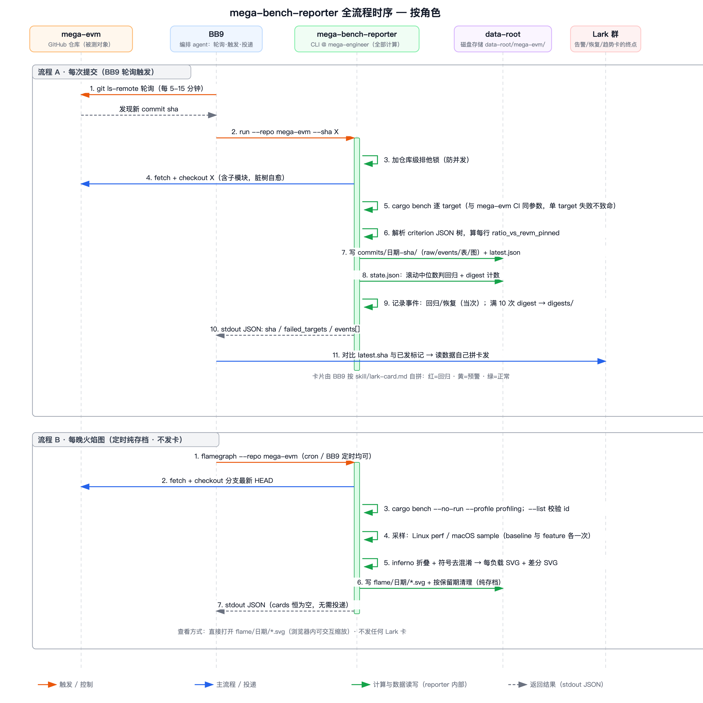

# mega-bench-reporter

Continuous benchmark-overhead tracking for Rust repos.
Every commit on a tracked branch gets benched with criterion, every subject is compared against a configured baseline (for mega-evm: vanilla `revm_pinned`), and the results land on disk as structured data: raw metrics JSON, charts, and factual events (regression / recovery / digest).

**Data only, by design.**
The tool renders no cards, sends no messages, and holds no messaging credentials.
A consuming agent (e.g. BB9) polls a single pointer file, reads the data, and composes whatever reports it wants — the repo-root [`skills/mega-bench-data/`](skills/mega-bench-data/SKILL.md) documents everything it needs.



## How it works

**Per commit** (`run --repo <name> --sha <sha>`):

1. Clone/fetch the tracked repo into `<data-root>/_checkouts/<repo>`, check out the sha (submodules included, transient network failures retried).
2. `cargo bench -p <package> --bench <target> -- --output-format bencher` per configured target — the exact invocation mega-evm's CI uses, so numbers stay comparable with the per-PR `/benchmark` flow.
   A failing target is recorded and skipped; the run only fails if every target fails.
3. Parse criterion's `target/criterion` tree and compute each row's `ratio_vs_baseline` (time ratio; > 1 = slower than the baseline).
4. With `[repos.instructions]` configured, run the instructions lane on the same checkout (CodSpeed offline simulation, Linux-only): deterministic CPU instruction counts per row — a second metric lane beside walltime. A skipped or failed lane leaves the run walltime-only.
5. Write the commit's data dir: `raw.json`, `compare_table.json`, `compare_bars.png`, `dist_*.png` (+ `instr_bars.png` when the commit has instructions data).
6. Check headline rows against their rolling medians — in both lanes — and record regression/recovery events; every Nth commit, roll a digest (`summary.json` + `trend.png`, plus `instr_series` + `instr_trend.png` for the instructions lane).
7. Atomically update `latest.json` — the pointer consumers poll.

**On demand** (`trend --repo <name> --last 30`, or `--from <sha> --to <sha>`, `--row <key>`, `--metric instructions` for the second lane): charts any window of already-stored commits into `trends/` — read-only, independent of the automatic digest.

**On decision** (`rebaseline --repo <name> --row <key-or-prefix*>`): accept a latched regression as the new normal — clears the matching rows' rolling history and latch from `state.json` so the next run re-baselines them without an alert.

**Nightly** (`flamegraph --repo <name>`): profile the configured workloads (Linux `perf` / macOS `sample`), render per-workload flame graphs + differentials via `inferno` into `flame/<day>/`, prune past retention.
Archive only — no events, plain cron is enough.

## Quick start

Requirements: `git` + a Rust toolchain, whatever the tracked repo needs to build (mega-evm: Foundry), and `perf` on Linux for flame graphs.
Charts need no Python/gnuplot/system fonts (embedded font; `inferno` is a library).

```bash
cargo build --release
./target/release/mega-bench-reporter run \
  --repo mega-evm \
  --sha $(git ls-remote https://github.com/megaeth-labs/mega-evm.git main | cut -f1) \
  --config repos.toml \
  --data-root ./data
```

stdout is one JSON summary — `{repo, sha, output_dir, failed_targets, events}` — and everything in it is also durable on disk, so you can run detached and read files after exit.

## Data on disk

```text
<data-root>/<repo>/
  latest.json             # discovery pointer: {sha, commit_dir, finished_at}
  commits/<YYYYMMDD>-<shortsha>/
    raw.json              # source of truth: mean ns + ratio_vs_baseline (+ instr counts)
    events.json           # this run's factual events: regression / recovery / digest
    compare_table.json    # table-ready: subjects[], rows[{item, p95_us[], headline_ratio}]
    compare_bars.png      # relative speed per item, baseline = 100%
    instr_bars.png        # relative instruction count per item (instructions lane)
    dist_*.png            # per-call time distributions (violin)
  digests/<YYYYMMDD>-<first>..<last>/
    summary.json          # headline ratio series over the window (+ instr_series)
    trend.png             # trend chart, red rings on threshold-tripping points
    instr_trend.png       # the instructions lane's trend (missing data = gaps)
  trends/<YYYYMMDD>-<first>..<last>/
    ...                   # manual `trend` runs, same shape as a digest
  flame/<YYYYMMDD>/       # nightly flame graphs (SVG + differential), archive-only
  state.json              # rolling windows, event latches, digest counter
```

Event semantics in one breath: a headline row rising more than `regression_threshold_pct` (default 10%) above the median of its last `rolling_window` (default 20) healthy runs records a regression event, latches (no repeats), and unlatches with a recovery event; regressed values never enter the window, so a sustained regression cannot rebaseline itself.
The instructions lane runs the same protocol over deterministic instruction counts with its own thresholds (`instr_regression_threshold_pct`, default 2%); its events carry `"metric": "instructions"`, and every walltime alert notes what instructions did for the same row (`instructions.verdict`).
Full schemas and rules: [`skills/mega-bench-data/references/data-layout.md`](skills/mega-bench-data/references/data-layout.md), [`skills/mega-bench-data/references/events.md`](skills/mega-bench-data/references/events.md).

## Configuration (`repos.toml`)

```toml
[defaults]                        # global tuning, overridable per repo
regression_threshold_pct = 10.0
# recovery_threshold_pct = 5.0    # hysteresis: recover only under this; unset = no hysteresis
rolling_window = 20
digest_batch_size = 10
# bench_profile = "profiling"     # unset = cargo's default bench profile (matches CI)

[[repos]]
name = "mega-evm"                 # repo key; also the cargo package unless `package` is set
github = "megaeth-labs/mega-evm"
branch = "main"
clone_url = "https://github.com/megaeth-labs/mega-evm.git"
bench_targets = ["transact", "revm_bench", "mega_bench", "comp_cost", "block_bench"]
baseline_subject = "revm_pinned"        # every ratio is against this subject
headline_subjects = ["rex5", "rex5_*"]  # exact or trailing-* patterns; these rows drive events
subject_order = ["revm_pinned", "revm_latest", "op_revm_pinned", "op_revm_latest",
                 "equivalence", "mini_rex", "rex4", "rex5"]  # optional table column order

[repos.flamegraph]                # optional; omit to disable the subcommand
bench_target = "mega_bench"
profile_secs = 30
retention_days = 30
workloads = [
  { baseline = "salt_dynamic_gas/revm_pinned/sstore_100", feature = "salt_dynamic_gas/rex5_salt/sstore_100" },
]
```

Adding a tracked repo = one `[[repos]]` entry + one `skills/mega-bench-data/references/repos/<name>.md` — no code change.

## For consuming agents

The skill is the contract; start at [`skills/mega-bench-data/SKILL.md`](skills/mega-bench-data/SKILL.md) and route from there:

| task | doc |
|---|---|
| invoke the CLI, flags, stdout shape | [`cli.md`](skills/mega-bench-data/references/cli.md) |
| find new runs, dedup by last-posted sha, recover from crashes | [`discovery.md`](skills/mega-bench-data/references/discovery.md) |
| interpret events and tuning | [`events.md`](skills/mega-bench-data/references/events.md) |
| every file and schema | [`data-layout.md`](skills/mega-bench-data/references/data-layout.md) |
| compose a Lark card (field mapping, red/yellow/green standard, verified example) | [`lark-card.md`](skills/mega-bench-data/references/lark-card.md) |
| mega-evm subject/group meanings | [`repos/mega-evm.md`](skills/mega-bench-data/references/repos/mega-evm.md) |

## Operations

- **Scheduling**: poll the branch with `git ls-remote` and invoke `run` on a new HEAD; `flamegraph` from plain cron.
- **Dedup**: consumers keep one marker (last posted sha) and compare it with `latest.json`.
- **Interruptions**: state is written last — a run killed mid-bench leaves nothing half-applied, and re-running the same sha is idempotent (artifacts refresh, state/events untouched).
- **Concurrency**: a per-repo lock makes a second invocation fail fast; never run two for the same repo.
- **Network**: clone/fetch retry twice with backoff on transient failures.
- **GitHub access**: none needed for public repos; set `GITHUB_TOKEN` for private ones (used via a git credential helper, never in argv).
- **Dev/regen**: `run --skip-bench` re-renders artifacts from the existing criterion tree (last processed sha only).

## Development

```bash
cargo test                        # unit + synthetic end-to-end pipeline tests
cargo fmt --all
cargo clippy --all-targets --locked -- -D warnings
cargo run --example render_samples -- /tmp/charts   # visual check of the chart types
```
